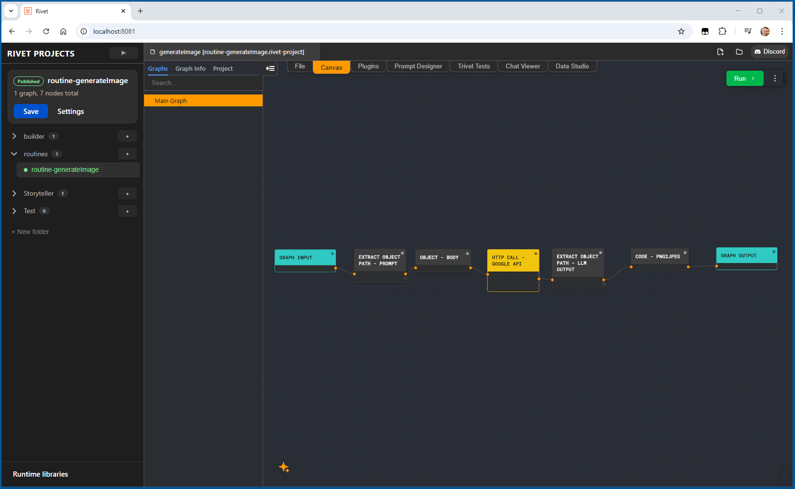

# Rivet Studio Server

This repo exists because Rivet does not provide a cloud-hosted platform for editing workflows and serving them directly as hosted endpoints.

A typical workflow is manual: install the desktop Rivet app, build the workflow locally, move the `.rivet-project` file into your own backend, write custom code to execute it, and build your own server layer if you want to expose that workflow as an HTTP endpoint. Updating a workflow then usually means going back to a local machine, editing it there, shipping the changed file again, and redeploying the backend that serves it.

Rivet Studio Server is a self-hosted personal Rivet platform with a UI that you can run on a VM or locally. It gives you both a browser-based Rivet editor and a server that can publish workflows as endpoints with no coding required, just a UI.
- Rivet editor: runs right in the browser
- Rivet project manager: create and reorganize folders and Rivet projects in the UI
- Publishing workflows as endpoints in one click - no coding required
- Remote debugger: set up and ready to go
- Runtime libraries manager: install libraries through the UI for use in the Rivet "Code" node
- Security: built-in authentication and authorization for both the Studio UI and workflow endpoints (See "Optional external UI gate")




## Additional docs

- [Architecture](./docs/architecture.md)
- [Access and routing](./docs/access-and-routing.md)
- [Development](./docs/development.md)
- [Editor bridge](./docs/editor-bridge.md)
- [Workflow publication](./docs/workflow-publication.md)
- [Runtime libraries](./docs/runtime-libraries.md)

## Quick Start

### Prerequisites

- Node.js 20+ and npm
- Git
- Docker and Docker Compose

### Deploy

```bash
npm run prod
```

`npm run prod` automatically pulls prebuilt images from `ghcr.io` when available (fast, works on small VMs with 1 GB RAM). If the pull fails it falls back to a local Docker build (requires 3 GB+ free RAM and the `rivet/` source tree).

Access the app at `http://localhost:8080` unless `RIVET_PORT` changes it.

If `npm run prod:prebuilt` or `docker compose pull` returns `denied` for the public GHCR images, clear any stale saved registry credentials first:

```bash
docker logout ghcr.io
```

Public images should pull anonymously. Old or invalid cached Docker credentials for `ghcr.io` can cause authenticated requests to fail even when the package itself is public.

Useful follow-up commands:

```bash
npm run prod:docker:ps
npm run prod:docker:logs
npm run prod:down
```

To pin a specific image tag, set `RIVET_IMAGE_TAG` or override the individual image names in `.env`.

#### Explicit variants

| Command | Behaviour |
|---|---|
| `npm run prod` | Auto — pull prebuilt images, fall back to local build |
| `npm run prod:prebuilt` | Always pull prebuilt images (no build) |
| `npm run prod:local-build` | Always build locally from source |

#### Building locally from upstream Rivet source

If you need a local build (e.g. to include custom changes), first download the upstream Rivet source into `./rivet`:

```bash
npm run setup:rivet
```

The script resolves the newest stable GitHub tag matching `v<major>.<minor>.<patch>` and downloads that release, not the moving `main` branch.

To replace an existing non-empty `rivet/` directory:

```bash
npm run setup:rivet -- --force
```

Then start the local build:

```bash
npm run prod:local-build
```

### Development with Docker

From the repo root:

`npm run dev`

Useful follow-up commands:

```bash
npm run dev:docker:ps
npm run dev:docker:logs
npm run dev:down
```

## Runtime shape

```text
Browser -> nginx (proxy)
           |- / -> web
           |- /api/* -> api
           `- /ws/executor* -> executor
```

## Security

- filesystem access is restricted to configured roots
- env var access is allowlist-only
- shell commands are allowlist-only
- path traversal is rejected on path parameters

### Optional external UI gate

- set `RIVET_KEY` to the shared secret
- set `RIVET_REQUIRE_WORKFLOW_KEY=true` to require `Authorization: Bearer <RIVET_KEY>` on workflow execution routes
- set `RIVET_REQUIRE_UI_GATE_KEY=true` to gate the browser UI and related websockets
- set `RIVET_UI_TOKEN_FREE_HOSTS` for hosts that should bypass the UI gate
